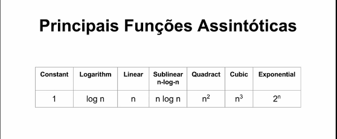

# techinterview
This project techinterview was create to save exercises related to technical interview for a new job

## - Funções Assintóticas

   
   1- função constante é a melhor, porque independe da entrada

    - operaçoes aritmeticas
    - expressoes boleanas
    - desvios condicionais
    - atribuição de variavel
    - Max Min em vetor ordenado
    - operação de Pilha e Fila
   2- depois da função constante a melhor é a função logaritmica pois o tempo de execução
      deste algoritmo será incrementado em uma constante sempre que o valor de entrada ser dobrado
   
    - Busca Binária (lista ordenada)
    - Inserção/Remoção em Heap
    - Busca/Travessia em Profundidade em Arvores Binarias Balanceadas(memoria)*
   3- outros dois algoritmo o linear e o sub-linear  
     linear é proporcional a tamanho de sua entrada
   
    - iteração (for, While)
    - Max/Min/Busca em lista não ordenada
    - Travessia em Arvore *
   4-  Sublinear tambem chamada de n_log_n (onde multiplicamos n * log n)

    - Ordenação complexa (merge, Quick, Heap)
    - ordenação da lib padrão *

        
   5- função quadratica

    - Ordenação simples (Selection, Insertion, Buble)
    - Travessia de Matrix Quadrada (x*N)
    - Iteração dentro de outra iteração*
   6- função cubica
     
    - Multiplicação Inocente de Matriz*

   7- função exponencial     

    - Fibonacci Recursivo Inocente
    - Torre de Hanoi*
